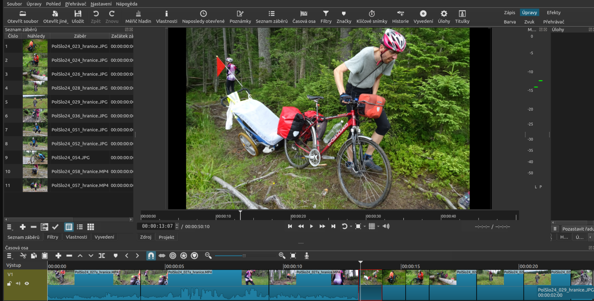

# Blok 7 – Střih videa (iMovie)

## Cíl

CHtěla jsem se naučit to jak se stříhají videa a také natáčet své vlastní videa.

---

## Postup

Nejdříve jsem si natočila 2-3 videa ať mám obsah natočený dopředu. Postupně jsem sestříhala všechny videa, přidala jsem do videa přechody a efekty. Naposled jsem si stáhla sestříhané video a vložila do canvy. V canvě jsem si nechala vygenerovat titulky k videím kde mluvím.

---

## Výstupy

- Exportovaný soubor `skola_den.mp4` (H.264, 1920×1080, 25 fps)
- Délka videa: 3 minuty 12 sekund
- Ukázka timeline:

---

---

## Teoretické pozadí (stručně)

Video je sekvence snímků přehrávaných rychlostí 25 fps – mozek vnímá plynulý pohyb. Střih je výběr a řazení záběrů do výsledného vyprávění. DaVinci Resolve pracuje s timeline, kde na stopách leží videoklipy a zvukové záznamy. Export generuje výsledný soubor komprimovaný kodekem H.264. Podrobnosti v `teorie.md`.

---

## Zdroje

- [https://www.blackmagicdesign.com/products/davinciresolve/training](https://www.blackmagicdesign.com/products/davinciresolve/training) – oficiální výukové materiály
- [https://www.youtube.com/@CaseyFaris](https://www.youtube.com/@CaseyFaris) – Casey Faris, přehledné tutoriály DaVinci
- [https://freemusicarchive.org/](https://freemusicarchive.org/) – hudba pod CC licencí použitá ve videu
